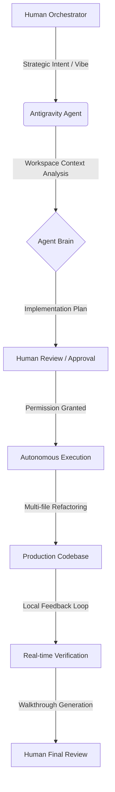

# Shift Drift: Technical Showcase in Agentic Web Development

## Overview
Shift Drift is a modern reimagining of the classic Asteroids arcade game, developed as a primary technical demonstration for Agentic First Vibe Coding. This project serves to validate the efficacy of high-velocity, autonomous development workflows orchestrated through the Antigravity assistant.

## Agentic Operations
The development process was characterized by a strict hierarchy of strategic orchestration and autonomous execution.

### Model Orchestration Matrix
The project utilized a multi-model strategy to balance velocity with architectural precision.

| Role | Models Orchestrated | Technical Contribution |
| :--- | :--- | :--- |
| High-Velocity Prototyping | Gemini 3.1 Flash | Rapid UI iteration, boilerplate generation, and iterative CSS styling. |
| Architectural Logic | Gemini 3.1 Pro | Complex state management, multi-file refactors, and Supabase integration. |
| Technical Validation | Claude Opus 4.6 | Verification of high-precision physics and structural oversight. |

### Engineering Workflow Architecture
The development followed a non-linear, agentic loop where the human developer acted as a strategic orchestrator rather than a line-by-line coder.

### The Workspace Brain
The .antigravity and .aiexclude files in the root directory serve as the project's "pre-frontal cortex." They define the technical boundaries, coding standards, and architectural constraints that guide the agent's autonomous decisions. Every major change is documented in the brain directory prior to execution, maintaining a transparent audit trail of AI intent.

### The Vibe Coding Methodology
Vibe Coding is a rigorous engineering discipline where the developer acts as an Architect and Orchestrator. The workflow follows a standardized cycle of planning, blueprinting, execution, and verification.
* Planning: The agent performs deep contextual research across the workspace to map dependencies and state management patterns.
* Blueprinting: An implementation plan is generated as an atomic blueprint, ensuring all changes are aligned with the project's long-term technical debt strategy.
* Execution: The agent performs multi-file edits, refactors legacy code, and integrates new layers autonomously.
* Verification: Automated and manual verification loops are used to validate the implementation against the original strategic intent.

## Technical Specifications
The application architecture is designed for performance, modularity, and rapid scalability.

### Core Stack
* Vite: Build tool for optimized bundling and instant Hot Module Replacement (HMR).
* Vue 3: Reactive component architecture for the landing page and UI overlays.
* Vanilla JavaScript: High-performance ES Modules for core physics and rendering.
* Canvas API: Direct-to-buffer rendering for high-precision, 60 FPS gameplay.
* Web Audio API: Dynamically synthesized soundscapes and real-time audio processing.

### Infrastructure and Persistence
* Supabase: Real-time PostgreSQL database for global leaderboard persistence and secure data synchronization.
* Vercel: Edge-optimized hosting infrastructure with integrated CI/CD pipelines.

## Project Statistics
* Development Time: Approximately 8 total hours of human-AI collaboration.
* Codebase Magnitude: Over 4,400 lines of strictly agent-developed logic.
* Deployment Strategy: CI/CD via Vercel with automated deployment on branch merge.

## Local Development
To initialize the development environment:
1. Clone the repository.
2. Execute npm install to resolve dependencies.
3. Run npm run dev to launch the development server.
4. Access the application at the local address provided in the terminal.

## Usage
* Thrust: W or Arrow Up
* Rotate: A/D or Arrow Left/Right
* Fire: Space
* Hyperspace: Shift
* Toggle Controls: ?
* Toggle Theme: R

## License
MIT License. Copyright 2026 Pixelorum Webentwicklung e. U.